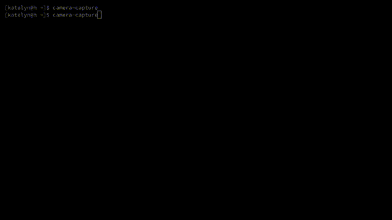

# camera-capture

## What is this?

A small script to assist with using a DSLR camera as a webcam, using gphoto2, ffmpeg, and v4l2loopback.

## Why is this?

I got sick of not being able to control the camera while 'recording' - change focus, adjust aperture, etc,
which comes in handy with changing lighting conditions and focus needs.

## Installation

Install the needed gems, and run it:

    gem install gphoto2 tty-prompt tty-spinner
    ./camera-capture

Written for ruby 2.7, but will probably work with as far back as 2.4 - untested, however.

## What can I/can't I do with it?

Currently, you can:

- Autofocus once (or more, if you're lucky!)
- Manually focus
- Adjust aperture
- Adjust shutter speed
- Send arbitrary gphoto2 configs
- Restart the capture

Known bugs:

- Autofocus. At least with my camera, it usually only ever focuses once. Attempting to 'cancel' and then
  re-focus has rarely, if ever, worked for me.
- Adjustment of other camera properties nicely (feel free to use the raw gphoto configs though)

## Tested Cameras

- Canon EOS Rebel T3i
- Canon EOS M50

## Desired features/"roadmap I may or may not ever get to"

- [ ] Fix autofocus
- [ ] Better interface for changing aperture/etc
- [ ] Feedback for what the current focus level is at (is that even possible..?)
- [ ] Ability to mess with the video feed (add filters, frames, rotate...)
- [ ] More customizability in terms of ffmpeg options (i.e. device name, type, format)
- [ ] Configuration saving/restoring

